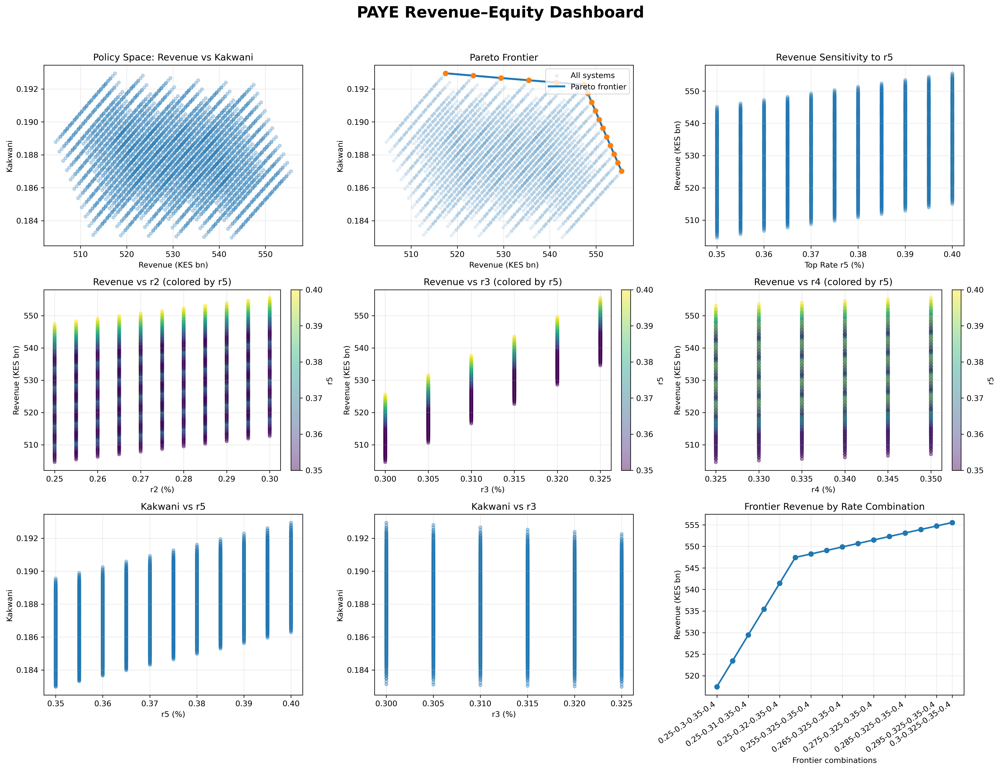

# PAYE Tax Simulation – Kenya

Simulation of PAYE tax policy alternatives using administrative payroll data to evaluate revenue–equity trade-offs.

This project builds a grid of alternative PAYE marginal tax rate structures and evaluates their impact on government revenue and tax progressivity using the Kakwani index.

The repository contains:

- A full PAYE microsimulation notebook
- A grid of simulated tax systems
- Revenue and progressivity metrics
- Visualization dashboards of the policy space and Pareto frontier

The analysis constructs a structured grid of marginal tax rate combinations and evaluates each tax system in terms of both **revenue performance** and **tax progressivity**. The resulting policy space is analyzed to identify the **Pareto frontier of efficient tax systems**, highlighting the trade-off between revenue generation and equity.

# Project Objective

The objective of this project is to analyze how alternative marginal PAYE tax rate structures affect:

- Total PAYE revenue
- Revenue changes relative to the baseline tax system
- The distribution of tax payments across the income distribution
- The progressivity of the tax system

Using taxpayer-level administrative employment income data, the simulation evaluates thousands of alternative tax systems and identifies **efficient PAYE structures that improve revenue and/or progressivity**.

# PAYE Structure Used in the Model

The model begins with the current Kenyan PAYE system consisting of **five marginal tax bands**.

The following parameters are held constant:

- **Band 1 marginal rate (r1): 10%**
- **Personal relief: KES 28,800**
- **Statutory income thresholds**

The remaining marginal rates are varied within a structured policy grid.

| Rate | Simulated Range |
|-----|----------------|
| r2 | 25% – 30% |
| r3 | 30% – 32.5% |
| r4 | 32.5% – 35% |
| r5 | 35% – 40% |

All simulated tax systems satisfy the progressive ordering condition:
r1 ≤ r2 ≤ r3 ≤ r4 ≤ r5

# Data Preparation

The simulation uses administrative employment income data.

From gross employment income, the notebook constructs **annual taxable employment income** after deducting statutory contributions such as:

- SHIF contributions
- Affordable Housing Fund (AHF)
- NSSF contributions

This taxable income is then used to compute PAYE liabilities under each simulated tax structure.

# Simulation Outputs

For each simulated tax system, the model computes the following metrics.

### Revenue Metrics

- Total PAYE revenue
- Revenue change relative to the baseline system
- Percentage revenue change

### Distributional Metrics

- Gini coefficient of taxable income
- Concentration index of tax payments
- Kakwani progressivity index

These indicators allow the analysis to evaluate both **fiscal performance** and **distributional outcomes** of alternative tax systems.
# Key Concepts

### Gini Coefficient

The Gini coefficient measures inequality in the distribution of **taxable income** across taxpayers.

### Concentration Index

The concentration index measures how **tax payments are distributed across the income distribution**.

### Kakwani Progressivity Index

The Kakwani index measures tax progressivity and is defined as:

A positive value indicates a **progressive tax system**, where higher-income taxpayers contribute a disproportionately larger share of tax relative to income.

# Revenue–Equity Policy Dashboard

The simulation results are summarized using a **Revenue–Equity Dashboard**, which visualizes the policy space across thousands of simulated PAYE systems.

The dashboard includes:

- Revenue vs progressivity policy space
- Pareto frontier of efficient tax systems
- Revenue sensitivity to marginal tax rates
- Progressivity responses across tax bands
- Frontier revenue by optimal rate combinations

These visualizations allow policymakers to identify tax systems that maximize revenue while maintaining strong progressivity.
# Pareto Frontier

The Pareto frontier represents the set of **policy-efficient PAYE systems**.

A tax system lies on the frontier if **no other simulated system produces both higher revenue and higher progressivity**.

The frontier therefore identifies the most efficient combinations of marginal tax rates within the simulated grid.

# Repository Structure
PAYE simulation grid/
│
├── PAYE_simulation_grid.ipynb
│ Main simulation notebook
│
├── paye_grid_r2_r5_full_data.xlsx
│ Full simulation results for all tax systems
│
├── paye_frontier_table.xlsx
│ Pareto-efficient PAYE rate combinations
│
└── README.md

# Requirements

The notebook uses standard Python data analysis libraries.
pandas
numpy
matplotlib
openpyxl

# Author
cyrus mutuku, 

